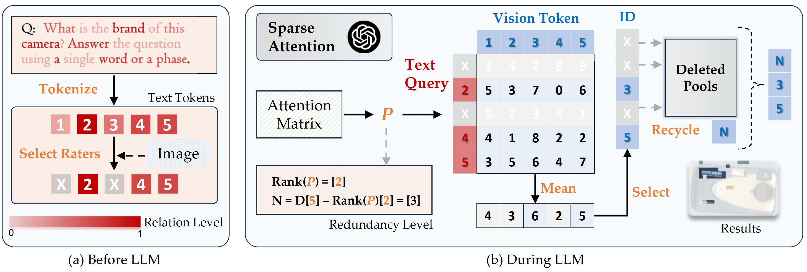
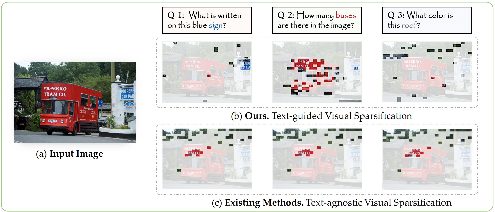

<div align="center">

<h1> SparseVLM: Visual Token Sparsification for Efficient Vision-Language Model Inference </h1>

<h5 align="center"> 

[Yuan Zhang](https://gumpest.github.io/)<sup>1,3* </sup>,
[Chun-Kai Fan](https://scholar.google.com/citations?user=TxeAbWkAAAAJ&hl=en&oi=ao)<sup>1*</sup>,
[Junpeng Ma]()<sup>2*</sup>,
[Wenzhao Zheng](https://wzzheng.net/)<sup>3✉️</sup>,
[Tao Huang](https://taohuang.info/)<sup>4</sup>,
[Kuan Cheng](https://cfcs.pku.edu.cn/people/faculty/kuancheng/index.htm)<sup>1</sup>,

[Denis Gudovskiy]()<sup>5</sup>,
[Tomoyuki Okuno]()<sup>5</sup>,
[Yohei Nakata]()<sup>5</sup>,
[Kurt Keutzer](http://people.eecs.berkeley.edu/~keutzer/)<sup>3</sup>,
[Shanghang Zhang](https://idm.pku.edu.cn/info/1017/1598.htm)<sup>1✉️</sup>

<sup>1</sup>School of Computer Science, Peking University, <sup>2</sup>Fudan University,

<sup>3</sup>UC Berkeley, <sup>4</sup>The University of Sydney, <sup>5</sup>Panasonic Holdings Corporation

</h5>
</div>

## 📜 News 
🔥 **[2025/06/04]** The sparsification code for **[VideoLLaVA](https://github.com/Gumpest/SparseVLMs/tree/video)** is now open source! Please check the `video branch`.

🔥 **[2025/05/01]** Our SparseVLM is accepted by **ICML 2025**!

🔥 **[2025/03/06]** We released **[SparseVLM v1.5](https://arxiv.org/pdf/2410.04417)**! **Higher Accuracy, Flexible Pruning Manner, and Compatibility with FlashAttention 2**!

🔥 **[2024/10/15]** We released **[SparseVLM](https://arxiv.org/pdf/2410.04417)** and its **[Project Page](https://leofan90.github.io/SparseVLMs.github.io/)**! The **[Code](https://github.com/Gumpest/SparseVLMs)** is now open-source!


<p align='center'>

</p>

## ✒️ Contents
- [News](#news)
- [Contents](#contents)
- [Overview](#overview)
- [Preparation](#preparation)
- [Usage](#usage)
- [Citation](#citation)
- [Acknowledgment](#acknowledgment)

## 👀 Overview

In vision-language models (VLMs), visual tokens usually consume a significant amount of computational overhead, despite their sparser information density compared to text tokens. To address this, existing methods extract more compact image representations by modifying the image encoder or projector. While some recent works further sparsify vision tokens during the decoding, they still ignore the guidance from the language tokens, which **contradicts the multimodality paradigm**. We argue that **visual tokens should be sparsified adaptively based on the question prompt**, as the model might focus on different parts (e.g., foreground or background) when dealing with various questions, as shown in Figure below. Unlike previous methods with text-agnostic visual sparsification (c) e.g., recent FastV, our SparseVLM (b) is guided by question prompts to select relevant visual patches.

<div align=center>

</div>

## 👨‍💻 Preparation

1. Clone this repository and navigate to SparseVLMs folder
```bash
git clone https://github.com/Gumpest/SparseVLMs.git
cd SparseVLMs
```

2. Install necessary package
```Shell
conda create -n SparseVLMs python=3.10 -y
conda activate SparseVLMs
pip install -e .
pip install transformers==4.37.0
pip install flash_attn==2.3.3
```

3. Download Multimodal Benchmark

Please follow the detailed instruction in [LLaVA-Evaluation](https://github.com/haotian-liu/LLaVA/blob/main/docs/Evaluation.md).

## 🎯 Usage
Specifically, `--retained_tokens` in script indicates the number of tokens to be retained after the SparseVLM algorithm. It supports three numbers of tokens, including **192, 128, and 64**. If a specific number of tokens is required, please make modifications in `./llava/model/language_model/score.py`

1. Example for evaluating MME results (default 192 tokens):
```Shell
CUDA_VISIBLE_DEVICES=0 bash scripts/v1_5/eval/mme.sh
```

2. Example for evaluating POPE results (default 192 tokens):
```Shell
CUDA_VISIBLE_DEVICES=0 bash scripts/v1_5/eval/pope.sh
```

3. Example for evaluating ScienceQA results (default 192 tokens):
```Shell
CUDA_VISIBLE_DEVICES=0 bash scripts/v1_5/eval/sqa.sh
```

4. Example for evaluating TextVQA results (default 192 tokens):
```Shell
CUDA_VISIBLE_DEVICES=0 bash scripts/v1_5/eval/textvqa.sh
```

5. Example for evaluating MMBench results (default 192 tokens):
```Shell
CUDA_VISIBLE_DEVICES=0 bash scripts/v1_5/eval/mmbench.sh
```

## License
This project is released under the [Apache 2.0 license](LICENSE).

## Citation

If you use SparseVLM in your research, please cite our work by using the following BibTeX entry:
```bibtex
@inproceedings{zhang2024sparsevlm,
  title={SparseVLM: Visual Token Sparsification for Efficient Vision-Language Model Inference},
  author={Zhang, Yuan and Fan, Chun-Kai and Ma, Junpeng and Zheng, Wenzhao and Huang, Tao and Cheng, Kuan and Gudovskiy, Denis and Okuno, Tomoyuki and Nakata, Yohei and Keutzer, Kurt and others},
  booktitle={International Conference on Machine Learning},
  year={2025}
}

```
## Acknowledgment

We extend our gratitude to the open-source efforts of [TCFormer](https://github.com/zengwang430521/TCFormer), [LLaVA](https://github.com/haotian-liu/LLaVA), [MiniGemini](https://github.com/dvlab-research/MGM) and [VideoLLaVA](https://github.com/PKU-YuanGroup/Video-LLaVA).
